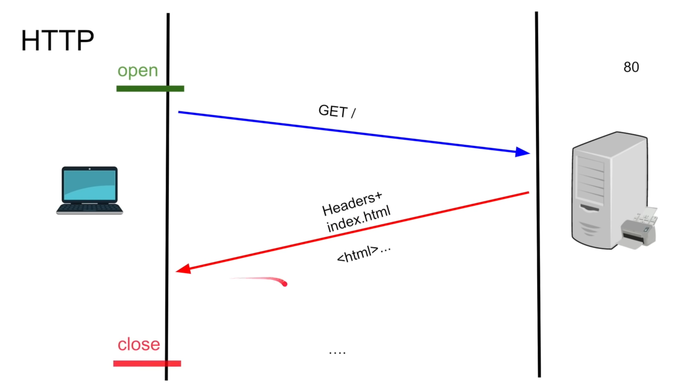
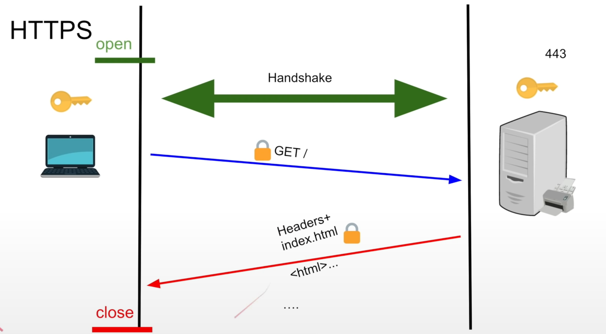
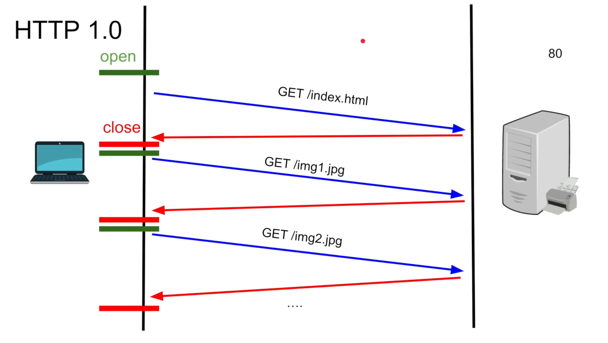
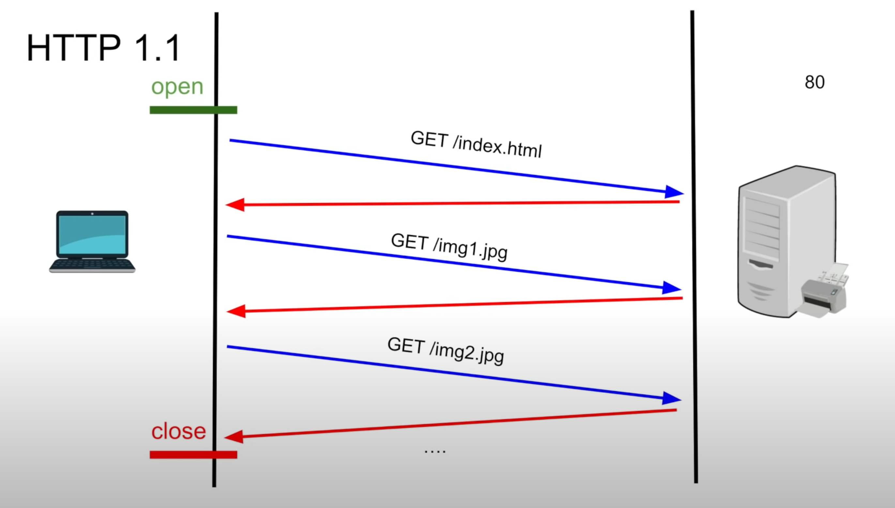

Going to cover
- HTTP anatomy
- HTTP 1.0 over TCP
- HTTP 1.1 over TCP
- HTTP/2 over TCP
- HTTP/2 over QUIC(HTTP/3)

HTTP request contains mainly
- URL
- Method type
- Headers
- Body

HTTP is a logical layer works at layer 7.

**HTTP connection establishment**

**HTTPS connection establishment**

 

## HTTP 1.0
- new TCP connection with each request
- slow
- buffering
- lasted only for one year 1997

##### HTTP 1.0 connection establishment

 

## HTTP 1.1
- uses keep-alive header
- persisted TCP connection
- low latency
- streaming with chunked transfer 
- pipelining(disabled by default)
- 1997 - 2015

##### HTTP 1.1 connection establishment

 

## HTTP 2

- dominant since 2015
- even though it looks like stateless, under the hood, it is a stateful.

#### Features
1. **Compression**:
    - HTTP/2 supports header compression, which reduces overhead by compressing HTTP header fields. 
    - This is accomplished through a mechanism called _HPACK_, which uses Huffman encoding and header field indexing to reduce redundancy and improve efficiency.
2. **Multiplexing**:
    - In HTTP/1.x, requests had to be sent serially, which could lead to head-of-line blocking and inefficiencies.
    - Multiplexing allows multiple requests and responses to be sent and received simultaneously over a single TCP connection.
    - With multiplexing in HTTP/2, multiple requests and responses can be interleaved, improving performance and reducing latency.
3. **Server Push**:
    - Server Push enables servers to proactively send resources to the client before they are requested. 
    - This is particularly useful for sending assets such as images, CSS, or JavaScript files that the server anticipates the client will need based on the initial request. 
    - By pushing resources to the client, HTTP/2 can reduce the number of round trips required to load a webpage, improving performance.
4. **SPDY**:
    - SPDY (pronounced "speedy") was an experimental protocol developed by Google that served as the basis for many of the features found in HTTP/2. 
    - It introduced concepts like multiplexing, header compression, and server push.
    - While HTTP/2 is based on SPDY, it is a standardized protocol with improvements and refinements over SPDY.
5. **Secured by Default**:
    - HTTP/2 is designed to work over both encrypted (TLS) and unencrypted connections, but major browsers and servers typically only support HTTP/2 over TLS. 
    - This means that HTTP/2 connections are secured by default, providing encryption and data integrity, which helps protect against various security threats such as eavesdropping and tampering.
6. **Protocol Negotiation during TLS (NPN/ALPN)**:
    - NPN (Next Protocol Negotiation) and ALPN (Application-Layer Protocol Negotiation) are TLS extensions that allow the client and server to negotiate which application layer protocol to use, such as HTTP/1.1, HTTP/2, or other protocols. 
    - ALPN is the preferred mechanism for negotiating HTTP/2 during the TLS handshake. This negotiation ensures that both the client and server support HTTP/2 before initiating the HTTP/2 connection, facilitating broader adoption and compatibility.

## HTTP/2 over QUIC (HTTP/3)

1. **Replaces TCP with QUIC (UDP with congestion control)**:
    - HTTP/3 replaces the traditional TCP (Transmission Control Protocol) transport layer with QUIC (Quick UDP Internet Connections), which is built on top of UDP (User Datagram Protocol). 
    - QUIC includes built-in congestion control mechanisms, similar to TCP, but operates over UDP, offering benefits such as 
	    - reduced connection establishment latency and 
	    - improved packet loss recovery.
2. **All HTTP/2 features**:
    - HTTP/3 retains all the features introduced in HTTP/2, such as header compression (using HPACK), multiplexing, server push, and secured by default (typically over TLS).
    - These features are designed to enhance web performance, reduce latency, and improve efficiency.
3. **In experimental phase**:
    - As of the last update, HTTP/3 is still in an experimental phase. While the specification has been largely finalized and implementations exist, widespread adoption is still ongoing, and there may be refinements and optimizations before it becomes more mainstream.
4. **Improved performance**: 
	- HTTP/3 aims to further improve performance compared to HTTP/2 by leveraging QUIC's features, such as 
		- reduced connection setup times and 
		- more efficient packet delivery over unreliable networks.
5. **Better support for mobile and high-latency networks**:
	- The design of HTTP/3 with QUIC is particularly beneficial for mobile networks and high-latency connections, where minimizing latency and reducing connection overhead are critical for delivering a smooth browsing experience.
6. **Migration challenges**: 
	- Transitioning from HTTP/2 to HTTP/3 may pose some challenges, as it involves replacing the underlying transport protocol and requires updates to both clients and servers. 
	- However, efforts are underway to facilitate this migration and ensure compatibility with existing web infrastructure.
7. **Potential for future enhancements**:
	- HTTP/3's adoption and development are ongoing, with ongoing efforts to optimize performance, address security concerns, and ensure interoperability across different implementations. 
	- As HTTP/3 matures, it may bring further innovations and improvements to web communication protocols.