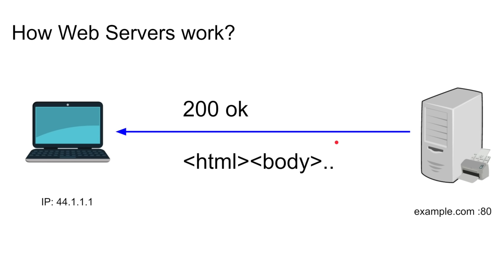
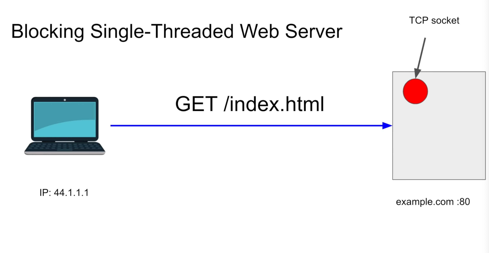
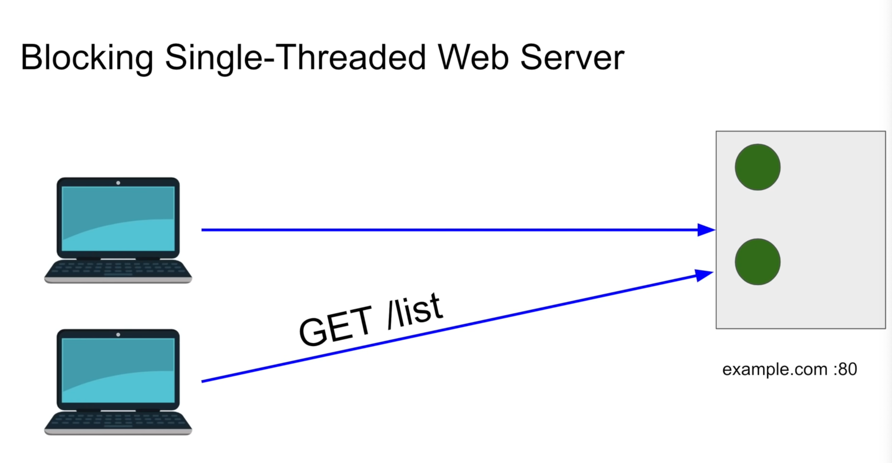

- a software that serves web content
- uses the HTTP protocol
- static and dynamic content
- used to host web pages, blogs and build APIs

default port for 
- http -> 80
- https -> 443

examples
- OTS web servers (httpd, IIS, lighttpd, tomcat, http-server)
- write your owner e.g. nodejs, python tornado

for every request, the server reserves memory using socket.

#### ETag
In web requests, an ETag (Entity Tag) is a mechanism used for validation and caching control. When a client (such as a web browser) makes a request to a server for a resource (such as a web page or an image), the **server** can include an ETag header in the response.

The ETag typically represents a unique identifier for the version of the resource being requested. It could be generated based on the content of the resource or other factors. When the client receives the resource along with the ETag, it can store this identifier.

Subsequent requests from the client for the same resource can include an `If-None-Match` header with the ETag value it received earlier. If the resource hasn't changed since the client last fetched it, the server can respond with a `304 Not Modified` status code, indicating that the client's cached version is still valid. This saves bandwidth and reduces server load because the server doesn't need to send the entire resource again.

If the resource has changed, the server can send the updated resource along with a new ETag, allowing the client to update its cache accordingly.

**ETags are part of the HTTP protocol and are commonly used for web caching and cache validation purposes, helping to improve performance and reduce unnecessary network traffic.**

Check 418 status code :-) 

