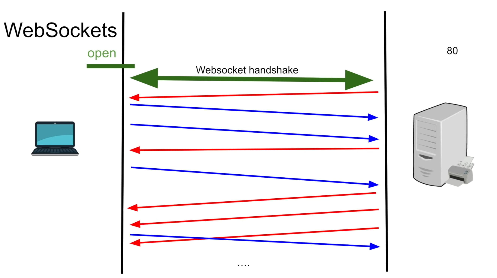
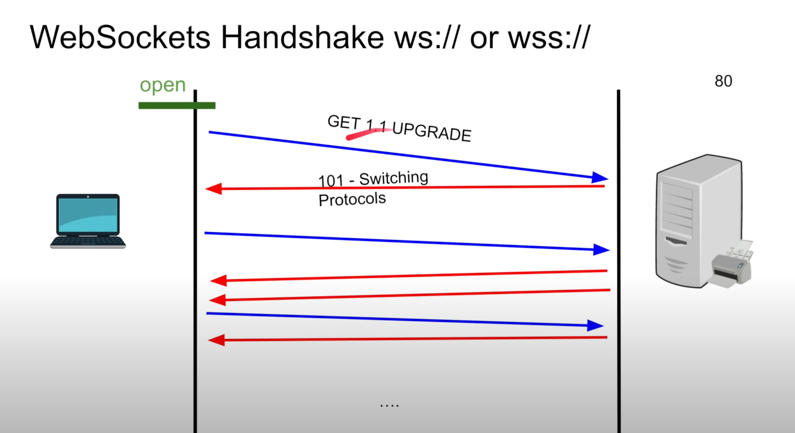
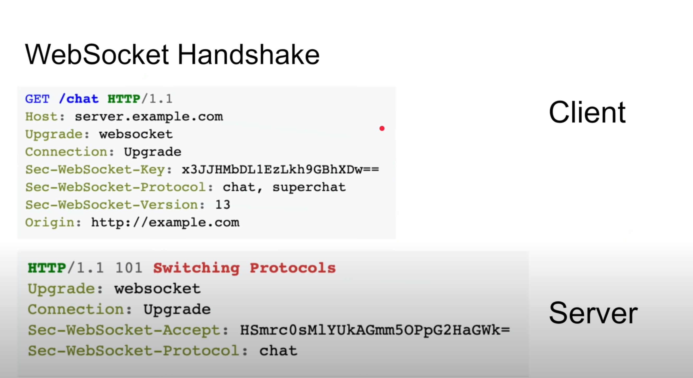

- bidirectional communication protocol between client and server over the web
- standardized in 2011
- completely compatible with HTTP
- stateful
- built on HTTP 1.1
- it is a stateful
- once the connection is established, either client or server can send data.
- persistent connection
- you can create your own WebSocket or you can use WebSocket library




WebSockets handleshake
ws:// -> http
wss:// -> over tls (secured)





1. client -> server : HTTP GET 1.1 request with header is UPGRADE
2. server -> client : if it supports ws, then status code 101 - switching protocols



Sec-WebSocket-Key
- The `Sec-WebSocket-Key` header plays a crucial role in the WebSocket handshake process, handshake acts as a verification mechanism, ensuring a secure and reliable connection between the client and the WebSocket server.
- The server 
	- concatenates the received `Sec-WebSocket-Key` with a well-known GUID `("258EAFA5-E914-47DA-95CA-C5AB0DC85B11")`.
	- It applies the ***SHA-1 hashing algorithm*** to this combined string.
	- Finally, it base64 encodes the hashed value.
- Security Benefits:
	- **Prevents Malicious Requests:** By requiring a random challenge and verifying the response, the server guards against non-WebSocket clients attempting to connect using standard HTTP methods.
	- **Mitigates Spoofing:** The use of a random key and a specific GUID makes it difficult for attackers to spoof legitimate WebSocket requests.

WebSockets use cases
- chatting
- live feed
- multiplayer gaming
- showing client progress/logging

**Note:** Stateful applications are not horizontally scalable.


Here are some common use cases for websockets:

1. **Real-Time Chat Applications**: Websockets are ideal for chat applications where instant messaging is required. They allow for bidirectional communication between users and servers, enabling instant message delivery without the need for constant polling.
    
2. **Live Updates and Notifications**: Websites or applications that require live updates, such as social media feeds, news tickers, or live sports scores, can benefit from websockets. They allow servers to push updates to clients instantly as soon as new data is available.
    
3. **Real-Time Collaboration Tools**: Web-based collaboration tools like Google Docs, Trello, or Figma rely on websockets to enable real-time editing and collaboration among multiple users. Changes made by one user are instantly reflected to others viewing the same document or project.
    
4. **Online Gaming**: Multiplayer online games often require real-time communication between players and the game server to synchronize game states and actions. Websockets provide low-latency, bidirectional communication, making them well-suited for online gaming applications.
    
5. **Financial Trading Platforms**: Websockets are commonly used in financial trading platforms to provide real-time updates on stock prices, market movements, and trading activities. Traders need up-to-the-millisecond information, and websockets allow for instant updates without the need for constant page refreshing.
    
6. **IoT (Internet of Things) Applications**: Websockets can be used in IoT applications to enable communication between IoT devices and servers. They allow devices to send data to servers in real-time, enabling remote monitoring, control, and automation of connected devices.
    
7. **Live Customer Support**: Websockets can enhance live customer support systems by enabling real-time communication between customers and support agents. This allows for faster response times and better customer satisfaction compared to traditional ticket-based systems.
    
8. **Real-Time Data Analytics**: Websockets are useful for real-time data analytics applications where data streams need to be processed and analyzed as they arrive. This could include monitoring website traffic, analyzing sensor data, or tracking social media mentions in real-time.
    
9. **Online Auctions and Bidding Platforms**: Websockets can provide real-time updates on auction bids and statuses in online auction platforms. This ensures that all participants have the most current information and can place bids without delays.
    
10. **Collaborative Drawing and Whiteboarding**: Applications that enable multiple users to collaborate on drawings or whiteboarding sessions in real-time can utilize websockets to synchronize drawing actions among participants instantly.

### Drawbacks
1. **Complexity**: Implementing and managing websockets can be more complex than traditional HTTP communication. Handling connection management, message formatting, and error handling requires careful attention to detail.
    
2. **Stateful Connections**: Websockets maintain an open connection between the client and server, which can introduce complexities related to managing state on both ends. This can impact scalability and resource usage on the server.
    
3. **Firewall and Proxy Issues**: Some network setups, particularly restrictive firewalls and proxies, may block or interfere with websocket connections. This can require additional configuration or negotiation to ensure connectivity.
    
4. **Overhead**: Maintaining persistent connections can introduce overhead, particularly for servers handling a large number of concurrent connections. This can impact server performance and scalability compared to stateless HTTP connections.
    
5. **Error Handling**: Errors in websocket connections can be more challenging to diagnose and handle compared to traditional HTTP errors. Handling disconnects, timeouts, and other issues gracefully requires careful consideration.
    
6. **Limited Browser Support**: While modern web browsers support websockets, older browsers or devices may not, requiring fallback mechanisms or alternative communication methods for compatibility.
    
7. **Security Concerns**: As with any network communication, security is a concern. Websockets are susceptible to attacks such as man-in-the-middle, DoS (Denial of Service), and injection attacks if not properly secured and validated.

<hr>

Demo code

server `index.js`
```js
const http = require("http");
const WebSocketServer = require("websocket").server;


let connection = null;

// http server has a socket 
const httpServer = http.createServer((req, res) => {
    console.log("we have received request");
});

const websocket = new WebSocketServer({
    httpServer
});

websocket.on("request", request => {
    connection = request.accept(null, request.origin);
    connection.on("open", () => {
        console.log("Opened!!");
    });
    connection.on("close", () => console.log("Closed!!"));
    connection.on("message", message => console.log(`received message ${message.utf8Data}`));
    sendEvery5seconds();
});

function sendEvery5seconds() {
    connection.send(`Message ${Math.random()}`);
    setTimeout(sendEvery5seconds, 5000);
}

httpServer.listen(8080, () => console.log("listening on port 8080"));
```

install package
`npm install websocket`

to run
`node index.js`

from server
`connection.send("hello from client")`


client
from the browser console,
```js
let ws = new WebSocket("ws://localhost:8080");
ws.onmessage = message => console.log(`We received a message from a server ${message.data}`);
ws.send("hello from client")

//to close the connection
ws.close()
```


<hr>

## WebSockets pros and cons

Pros
- full-duplex (no polling)
- HTTP compatible
- firewall friendly (standard)

Cons
- proxying is tricky
- level 7 load balancing is challenging (timeouts)
- stateful, difficult to horizontally scale -> solution is to store the state in db and read if server restarts or client disconnects 
- server does not know whether client is disconnected or not

Do you have to use websockets?
- If you absolutely need bidirectional communication, you can use it.
- long polling
- eventsource
