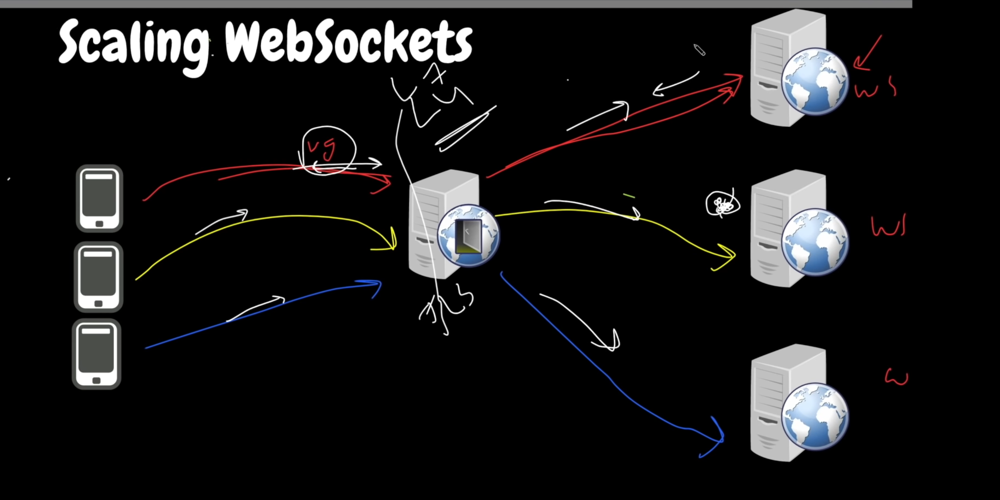

We can use nginx/ha proxy to communicate between clients and servers.
The requests from one client **will not be load balanced** as the state is stored in a particular server.

To make use of a load balancer, you need to save the state in a server.
